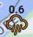

## About the project

Hi! This project was created to improve the commuting experience; Many a times I have spent at least ***5 seconds*** switching apps between the local weather app and google maps... :weary:
**But** now, you too can enjoy this project to save some time in your travels :grin:
It is still very much a work in progress, with more improvements to come in the future!

For now, just type in your travel origin, your travel destination, the travel mode and hit route to get your estimated travel time and duration! (Currently still limited to Singapore)

Notes:
- Weather API automatically updates every 60 seconds based on results from the realtime API
- Cloud / Rain Icons show the location of each weather station
    - Cloud Icons show areas that do not currently observe any rain
    - Rainy Icons show registered rain in mm
        -  No Rain (0mm)
        -  Light Rain (< 0.5mm)
        -  Moderate Rain (>= 0.5mm & < 1mm)
        -  Heavy Rain (>= 1mm & < 1.5mm)
        -  Very Heavy Rain (>= 1.5mm)
             
Built using :
- [React](https://reactjs.org/) 
- [react-google-maps-api library](https://react-google-maps-api-docs.netlify.app/) (Handles most interactions with vanilla google maps JS API)
- [use-places-autocomplete](https://www.npmjs.com/package/use-places-autocomplete) (Handles autocomplete fields)
- [MUI](https://mui.com/)
- [Weather SVG Library by Erik Flowers](https://github.com/erikflowers/weather-icons)

This uses the:
1. [Google Maps JS API](https://developers.google.com/maps/documentation/javascript/reference)
2. Google Maps Autocomplete API
3. Google Maps Geocoding API
4. Google Maps Routes API
5. [Realtime rain data from data.gov.sg API](https://data.gov.sg/dataset/realtime-weather-readings?resource_id=8bd37e06-cdd7-4ca4-9ad8-5754eb70a33d)

## How it works:

<!-- Insert excalidraw img -->

It's pretty simple!

### Map.js
- Core Functions
    - Receives input data from PlacesAutocomplete.js (nav-bar) to **POST** request to Google Maps Routes API -> Renders directions response from Routes API onto map
    - Receives **reformatted response** data from data.gov.sg API -> generates markers and appropriate icons and renders on maps JS API via the *Marker* function *react-google-maps-api* library

### stationsData.js
- Core Functions
    - Is initialized at start of loading the website and calls the data.gov.sg website every 60 seconds
    - Checks status of response, and if *'OK'*, extracts key fields within the response and passes the reconstructed response back to Map.js for rendering of weather markers

### placesAutocomplete.js
- Core Functions
    - Provides input parameters to feed into Map.js to query google Routes API
    - Selects Google Maps layer automatically when a certain travel mode is selected (default traffic layer)
        >eg. Selecting 'transit' icon will make google maps render the transit layer

### About.js
- Core Function
    - Some info about the project!

<!-- ## Project Presentation

10 minute presentation (suggested flow)

- 2 minute demo of your application
- Show us the functionality!
- What is the application about?
- What are the user stories for your application?
- What API did you choose to use?
- Walk through a piece of code
- What was the most difficult part of the project?
- What was your favourite part of your project?
- What would you like to add next? -->

### Future Goals
- Advanced weather imaging
    - Adding a weather radar overlay from public sources to have a generic and accurate overview of incoming / current rain
        - Based on image inferences, decide if the user will encounter rain during the duration of the journey
- Combining weather radar, realtime API, forcast API to determine likelihood of rain in a particular sector
- Historical weather Database
- Own API providing weather forecasts based on ^
- Implementation of more detailed directions and display leg-of-journey info
- Make it into a mobile app!
- Extend functionality into a different region